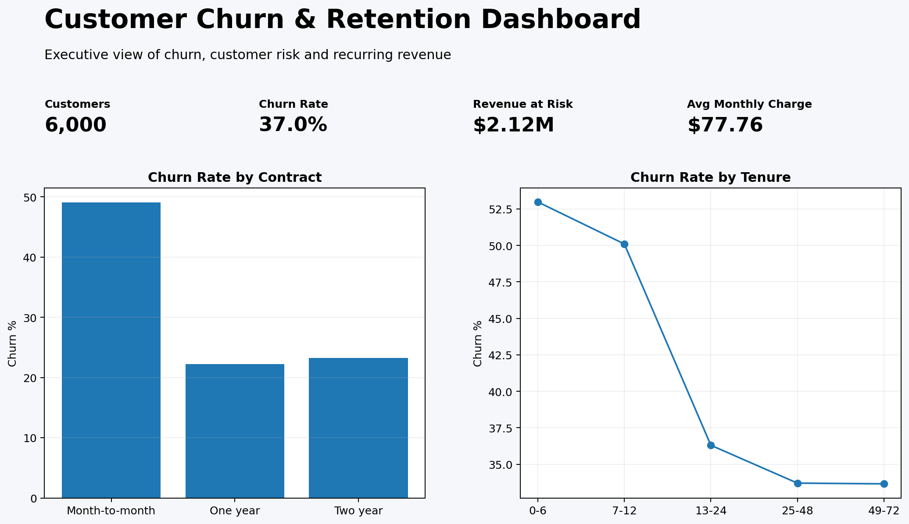

# 📉 Customer Churn & Retention Analytics


## What is this project about?

I built this project to understand why customers leave a business and, more importantly, how a company could use data to identify customers who are at risk of leaving.

Instead of only looking at the overall churn percentage, I wanted to look deeper into the customer data and answer questions such as:

- Are new customers more likely to leave?
- Does the type of contract affect churn?
- Are customers with lower satisfaction more likely to leave?
- How much revenue could the business lose from customers who churn?
- Which customers should the company focus on first?

I created a synthetic customer dataset so the complete project can be shared publicly on GitHub without using real customer information.

---

## 🎯 The Business Problem

Customer churn is a major problem for subscription-based businesses.

If a customer leaves, the company doesn't just lose one transaction. It can lose months or years of future revenue.

So I approached this project from a business perspective:

> **"If I were a data analyst working for this company, how could I use customer data to help the retention team decide who they should focus on?"**

That became the main question behind the project.

---

## 📊 What I Found

After analyzing **6,000 customers**, several patterns stood out.

### Contract type matters

Customers on month-to-month contracts have noticeably higher churn than customers who have committed to longer contracts.

This suggests that moving suitable customers toward longer-term contracts could potentially improve retention.

### New customers are more vulnerable

Customers in the early stages of their relationship with the company show higher churn.

This made me think that the first few months of the customer journey could be especially important.

A business could use this information to improve onboarding and proactively contact new customers who show warning signs.

### Customer satisfaction is important

Customers with lower satisfaction scores are more likely to churn.

This means customer satisfaction shouldn't just be treated as a support metric. It can also be used as an early warning signal.

### Revenue matters when prioritizing churn

Not every churned customer has the same financial impact.

For example, losing a customer paying $20 per month is very different from losing a customer paying $150 per month.

So I calculated **estimated annual revenue at risk** to help prioritize customers that could have the biggest financial impact.

---

## 📈 Key Numbers

| Metric | Result |
|---|---:|
| Customers analyzed | **6,000** |
| Churn rate | **37.0%** |
| Estimated annual revenue at risk | **$2.12M** |
| Average monthly charge | **$77.76** |

These numbers are based on the synthetic dataset created for this portfolio project.

---

## 📸 Dashboard



The dashboard gives a quick view of:

- Overall churn rate
- Revenue at risk
- Customer count
- Average monthly charge
- Churn by contract
- Churn by customer tenure
- High-value customers who have churned

The idea was to make the analysis something a business manager could actually use rather than just a collection of charts.

---

## 🔎 Supporting Analysis

### Churn by Contract


This comparison helps show which contract groups are more exposed to churn.

### Churn by Internet Service


This looks at whether churn patterns differ across service types.

### Churn by Tenure


This helps identify whether customers are most vulnerable early in their relationship with the company.

---

## 🔬 How I Worked on the Project

### 1. Created the customer dataset

I created a synthetic dataset containing information such as:

- Customer ID
- Age
- Tenure
- Contract type
- Internet service
- Payment method
- Support tickets
- Monthly charge
- Satisfaction score
- Churn status

### 2. Prepared the data

Using Python and Pandas, I worked with the customer-level data and created additional business metrics.

One of the most important metrics I created was **Estimated Annual Revenue at Risk**.

This estimates the annual recurring revenue associated with customers who have churned.

### 3. Explored the data

I compared churn across different customer groups:

- Contract type
- Customer tenure
- Internet service
- Payment method
- Satisfaction
- Support activity

This helped me move from simply asking **"How many customers churned?"** to asking **"Who is churning and what patterns can I see?"**

### 4. Used SQL

I also recreated important business questions using SQL.

The SQL analysis covers:

- Overall churn rate
- Churn by contract
- Highest-value churned customers
- Churn by tenure
- Revenue at risk by payment method

### 5. Built the dashboard

Finally, I created a Streamlit dashboard to make the results easier to explore.

The dashboard gives a manager a quick overview first and then allows them to investigate the customer segments behind the numbers.

---

## 🛠️ Tools I Used

**Python** — main analysis language

**Pandas** — data cleaning, transformation and analysis

**NumPy** — numerical calculations

**SQL** — business analysis and querying

**Matplotlib** — static charts

**Plotly** — interactive visualizations

**Streamlit** — interactive dashboard

**GitHub** — version control and portfolio presentation

---

## 📁 Project Structure

```text
customer-churn-retention-analytics/
│
├── data/
│   └── customers.csv
│
├── reports/
│   ├── kpis.csv
│   ├── contract_churn.csv
│   ├── internet_churn.csv
│   ├── tenure_churn.csv
│   ├── churn_by_contract.png
│   ├── churn_by_internet.png
│   └── churn_by_tenure.png
│
├── screenshots/
│   ├── customer_churn_dashboard.png
│   ├── churn_by_contract.png
│   ├── churn_by_internet.png
│   └── churn_by_tenure.png
│
├── sql/
│   ├── schema.sql
│   └── analysis_queries.sql
│
├── src/
│   └── analysis.py
│
├── dashboard.py
├── requirements.txt
└── README.md
```

---

## ▶️ Running the Project

If you want to run the dashboard locally:

```bash
git clone YOUR_GITHUB_REPOSITORY_URL
cd customer-churn-retention-analytics
pip install -r requirements.txt
streamlit run dashboard.py
```

The Streamlit dashboard will then open in your browser.

---

## 💡 What I Would Do Next

This project is focused on analytics rather than machine learning.

If I continued developing it, I would:

- Build a machine-learning model to predict future churn
- Use SHAP to explain individual predictions
- Add customer lifetime value
- Build cohort retention analysis
- Connect the project to PostgreSQL
- Deploy the dashboard online
- Add automated data-quality checks

---

## 💼 What This Project Demonstrates

Through this project, I wanted to demonstrate that I can do more than just create charts.

I can:

**Start with a business problem → work with data → analyze the data → find patterns → calculate useful KPIs → communicate the findings → and turn the results into something a business could actually use.**

That's the main reason I built this project as part of my data analytics portfolio.

---

## 👨‍💻 About Me

I'm building my portfolio around practical data analytics projects where I can combine technical skills with business thinking.

I'm particularly interested in opportunities where I can work with data, find useful insights, and help teams make better decisions.

**LinkedIn:** YOUR_LINKEDIN_URL

**GitHub:** YOUR_GITHUB_URL
